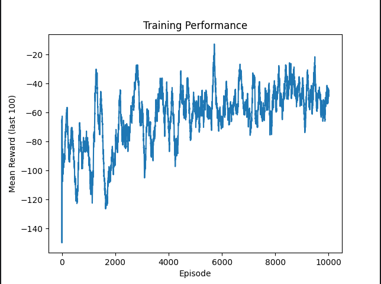
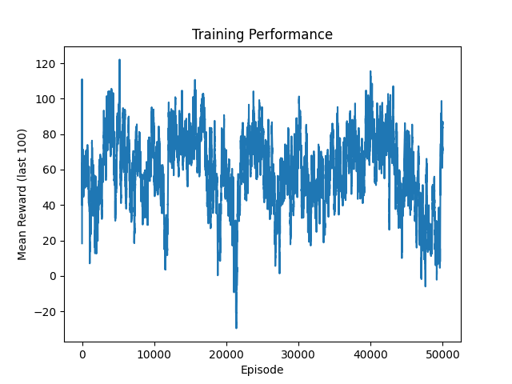
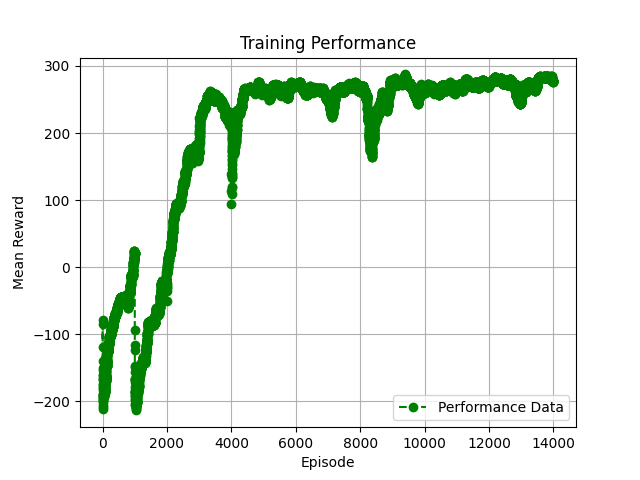
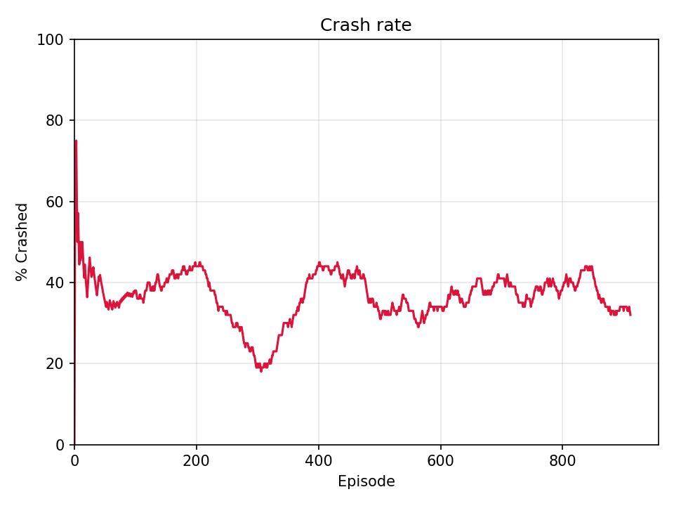

# Solving the Lunar Lander Problem with Reinforcement Learning

## 1. Introduction

The Lunar Lander is a classic control problem provided by the [Gymnasium](https://gymnasium.farama.org/) library (formerly OpenAI Gym). The goal is to train an agent to safely land a spacecraft between two flags on a landing pad, using as little fuel as possible.

At each timestep, the agent receives an **8-dimensional state vector** describing the lander's position, velocity, angle, angular velocity, and whether each leg is in contact with the ground. It must then choose one of **4 discrete actions**: do nothing, fire the left engine, fire the main engine, or fire the right engine.

The **reward function** is designed to encourage smooth, precise landings:
- The agent gains reward for moving toward the landing pad and loses reward for moving away.
- Each leg touching the ground grants +10 points.
- Firing the main engine costs -0.3 points per frame; firing a side engine costs -0.03 points.
- A crash results in -100 points; a successful landing yields +100 points.

An episode is considered **solved** when the agent achieves a mean reward of +200 or more over 100 consecutive episodes.

This problem is challenging because the state space is continuous and high-dimensional, the agent must balance multiple competing objectives (fuel efficiency, stability, precision), and small mistakes early in a trajectory can have large consequences later. These properties make it an excellent benchmark for comparing reinforcement learning algorithms of increasing sophistication.

In this report, we explore three algorithms of increasing complexity: **Q-Learning**, **Deep Q-Network (DQN)**, and **Proximal Policy Optimization (PPO)**, and show how each addresses the limitations of the previous approach.

---

## 2. Q-Learning

### 2.1 What is Q-Learning?

Q-Learning is a **model-free, value-based** reinforcement learning algorithm. The core idea is to learn a function $Q(s, a)$ — called the **action-value function** — which estimates the expected cumulative reward an agent will receive by taking action $a$ in state $s$ and following the optimal policy thereafter.

These values are stored in a **Q-table**: a lookup table indexed by state-action pairs. At each step, the agent picks the action with the highest Q-value (exploitation), or occasionally picks a random action to explore the environment (exploration), controlled by an $\epsilon$-greedy policy.

After each interaction with the environment, the Q-table is updated using the **Bellman equation**:

$$Q(s, a) \leftarrow Q(s, a) + \alpha \left[ r + \gamma \max_{a'} Q(s', a') - Q(s, a) \right]$$

Where:
- $\alpha$ is the learning rate
- $\gamma$ is the discount factor, controlling how much the agent values future rewards
- $r$ is the immediate reward received
- $s'$ is the next state

Given enough episodes, Q-Learning is guaranteed to converge to the optimal policy — but only if every state-action pair is visited sufficiently often.

### 2.2 The Problem: A Continuous State Space

The Lunar Lander environment has a **continuous** 8-dimensional state space, meaning states are real-valued vectors with theoretically infinite possible combinations. A naive Q-table over this space would need to store a value for every possible state-action pair — which is computationally impossible. In practice, with continuous inputs, no state is ever visited twice, so the Q-table never gets updated enough to learn anything meaningful, and training stagnates entirely.

### 2.3 Our Solution: State Discretization

To make Q-Learning applicable, we applied **state discretization**: each continuous state dimension is divided into a fixed number of bins, mapping real-valued observations to discrete indices. This reduces the infinite state space to a finite, tractable Q-table.

For example, a position value ranging from $-1.5$ to $+1.5$ might be split into 10 bins, so any value in $[-1.5, -1.2)$ maps to bin 0, values in $[-1.2, -0.9)$ map to bin 1, and so on. The full state becomes a tuple of bin indices, which serves as the key into the Q-table.

The choice of bin count is a critical trade-off:
- **Too many bins** → the table remains too large; states are rarely revisited and learning is slow.
- **Too few bins** → too much information is lost; the agent cannot distinguish between meaningfully different states.

After tuning the discretization granularity, the Q-table became compact enough for updates to accumulate meaningfully, and training began to show progress.

### 2.4 Results

Despite the improvement brought by discretization, Q-Learning still showed **significant limitations** on this problem. Figure 1 shows the result of the first training run over 10,000 episodes. The mean reward starts around $-150$ and trends slowly upward, but remains highly volatile, plateauing around $-40$ to $-30$ by the end — far below the +200 threshold required to consider the problem solved.

*Figure 1: Mean reward (averaged over the last 100 episodes) during the first Q-Learning training run. Progress is slow and noisy; the agent never approaches a solved policy.*

Given these poor results, we continued training by reloading the saved Q-table and running additional episodes, allowing the agent to keep building on previously learned values. Figure 2 shows the evolution of performance across this extended training process, totalling 50,000 episodes. While the mean reward does improve significantly compared to the first run — stabilizing around $+60$ to $+80$ — it remains well below the solved threshold and never converges to a stable policy.

*Figure 2: Mean reward accumulated across multiple consecutive training sessions. Despite the large number of episodes, performance plateaus far below the +200 target and exhibits persistent instability.*

The fact that even this extended, multi-session training fails to solve the environment is a fundamental indictment of the approach. The core issue is that discretization is a lossy approximation — fine-grained distinctions between states are erased, limiting how precisely the agent can learn. Furthermore, the table-based approach scales poorly: adding more bins to improve accuracy exponentially increases the table size (a phenomenon known as the **curse of dimensionality**). With 8 state dimensions, even moderate bin counts produce a table with millions of entries, most of which are never visited.

These limitations motivate the move to a function approximation approach — replacing the Q-table with a neural network, as done in Deep Q-Learning.

---

## 3. Deep Q-Learning

### 3.1 From Q-Tables to Neural Networks

The limitations of Q-Learning make one thing clear: a lookup table is not a viable way to represent knowledge about a continuous, high-dimensional state space. The natural solution is to replace the table with a **function approximator** — specifically, a neural network — that can generalize across similar states without requiring each one to be visited individually.

This is the core idea behind **Deep Q-Learning (DQL)**, introduced by DeepMind in 2013 and made famous for reaching human-level performance on Atari games using only raw pixel inputs. Instead of storing $Q(s, a)$ explicitly, a neural network parameterized by weights $\theta$ learns to predict Q-values for all actions simultaneously given an input state: $Q(s, a; \theta)$. The agent then simply selects the action with the highest predicted Q-value.

### 3.2 Key Components

#### A. Two Q-Networks: Local and Target

A naive approach of training a single network to predict its own targets leads to instability — the targets shift every time the weights are updated, creating a moving-target problem. DQL solves this by maintaining **two separate networks** with identical architectures:

- The **local Q-network** is actively trained at every update step.
- The **target Q-network** has its weights frozen and is used solely to compute stable training targets.

The target network is updated gradually using a **soft update** rule:

$$\theta_{target} \leftarrow \tau \cdot \theta_{local} + (1 - \tau) \cdot \theta_{target}$$

With a small $\tau$ (e.g. $0.001$), the target network drifts slowly toward the local network, keeping training targets stable enough for the network to converge.

#### B. Experience Replay

Rather than training on consecutive transitions — which are highly correlated and would cause the network to overfit to recent events — DQL stores past transitions $(s, a, r, s', done)$ in a **replay memory buffer**. At each training step, a random mini-batch is sampled from this buffer.

This breaks temporal correlations, allows experiences to be reused multiple times, and ensures the network sees a diverse mix of situations at every update, leading to more stable and data-efficient learning.

#### C. Epsilon-Greedy Exploration

Like Q-Learning, DQL uses an **$\epsilon$-greedy policy** to balance exploration and exploitation. Epsilon starts at $1.0$ (fully random) and decays multiplicatively after each episode, gradually shifting the agent from exploration toward exploitation as its Q-value estimates improve.

### 3.3 Hyperparameter Tuning

One important challenge encountered during training concerned the **discount factor $\gamma$**. An initial value of $\gamma = 0.95$ caused the agent to be overly short-sighted: by discounting future rewards too heavily, it failed to properly value actions whose benefits only materialize several steps later — such as carefully positioning the lander before the final descent. This resulted in suboptimal exploration and slow improvement.

Raising $\gamma$ to $0.99$ encouraged the agent to reason over longer time horizons, significantly accelerating convergence. This highlights a key advantage of DQL over tabular Q-Learning: hyperparameters like $\gamma$ have a direct, interpretable effect on behavior and can be tuned without the combinatorial complexity of bin-count adjustments.

### 3.4 Results

The improvement over Q-Learning is dramatic. Trained in a **single session of 14,000 episodes** — compared to the 50,000+ episodes across multiple runs required by Q-Learning — the DQL agent achieved successful and consistent landings, demonstrating that replacing the Q-table with a neural network fundamentally changes what is achievable.

> 
> *Figure 3: Mean reward during DQL training over 14,000 episodes. The agent converges to a successful policy within a single training session.*

The contrast with Q-Learning is stark: where the tabular approach required repeated retraining and still never solved the environment, DQL converges cleanly and efficiently. The combination of experience replay, dual Q-networks, and soft updates provides the stability needed to train reliably in a continuous state space.

That said, DQL is not without limitations. It is restricted to **discrete action spaces**, its performance is sensitive to network architecture and hyperparameter choices, and tuning can require significant experimentation. These considerations motivate the exploration of policy-based methods, which directly optimize the agent's behavior rather than estimating value functions.

---

## 4. Proximal Policy Optimization (PPO)

### 4.1 Motivation

Having achieved strong results with DQL, we wanted to explore a fundamentally different class of algorithm — one capable of handling a more challenging variant of the environment. In this version of LunarLander, random wind perturbations are introduced during each episode, creating unpredictable forces that destabilize the lander mid-flight. This requires the agent to be robust to stochasticity: it must learn not just a fixed optimal behavior, but a policy that adapts gracefully when the environment behaves unexpectedly.

DQL, as a deterministic value-based method, is not well-suited to this setting. Its action selection is rigid — it always picks the action with the highest Q-value — which makes it brittle when the environment deviates from what it learned during training. What is needed instead is an algorithm that maintains a degree of **controlled randomness** in its policy, allowing it to hedge against uncertainty rather than commit fully to a single action.

**Proximal Policy Optimization (PPO)**, introduced by OpenAI in 2017, is precisely designed for this. Rather than learning a value function and deriving a policy from it, PPO directly optimizes the policy itself — a neural network that outputs a probability distribution over actions. This stochasticity is a feature, not a bug: by sampling from a distribution rather than always picking the best known action, the agent naturally handles environmental uncertainty and avoids being thrown off by random perturbations.

### 4.2 How PPO Works

PPO belongs to the family of **policy gradient** methods. At each training step, the agent collects a batch of experience by running its current policy in the environment. It then computes the **advantage** of each action taken — an estimate of how much better or worse that action was compared to what the policy would typically do in that state — and updates the policy to make advantageous actions more likely.

The key innovation of PPO is a **clipped surrogate objective** that prevents the policy update from being too large in any single step:

$$L^{CLIP}(\theta) = \mathbb{E}_t \left[ \min \left( r_t(\theta) \hat{A}_t,\ \text{clip}(r_t(\theta),\ 1-\varepsilon,\ 1+\varepsilon)\ \hat{A}_t \right) \right]$$

Where $r_t(\theta)$ is the ratio of the new policy probability to the old one, $\hat{A}_t$ is the estimated advantage, and $\varepsilon$ is a small clipping threshold (typically $0.2$). This clipping ensures that even if the gradient pushes strongly in one direction, the policy cannot change too drastically — leading to stable, monotonically improving training without the need for a complex replay buffer or dual network architecture.

### 4.3 Results

Because this variant of the environment introduces random wind perturbations, direct comparison with the DQL results is not straightforward — the task is genuinely harder. Rather than tracking mean reward, we measured the agent's **crash rate** over training, which captures the most safety-critical aspect of the landing problem.

*Figure 3: Percentage of episodes ending in a crash during PPO training. The crash rate drops from ~75% at the start to below 30% toward the end of training, demonstrating that the agent learns to handle random wind perturbations effectively.*

As shown in Figure 3, the crash rate begins near 75% — the agent initially has no strategy for dealing with the perturbations — and trends downward over ~950 episodes, falling below 30% by the end of training. The curve is noisy, reflecting the inherent difficulty of the stochastic environment, but the overall downward trend is clear.

It is important not to interpret these numbers as PPO underperforming relative to DQL. The two algorithms are solving different problems: DQL operates in a stable environment, while PPO must contend with unpredictable forces on every episode. The fact that PPO drives the crash rate below 30% in a perturbed environment — in under 1,000 episodes — is a strong result, and speaks directly to its suitability for stochastic control tasks.

---

## 5. Conclusion

This project set out to solve the Lunar Lander problem using three reinforcement learning algorithms of increasing sophistication, each addressing the limitations of the previous.

**Q-Learning** established a baseline, but its reliance on a discrete Q-table made it fundamentally ill-suited to the continuous state space of LunarLander. Even after applying state discretization to make training tractable, the agent required over 50,000 episodes across multiple training sessions and never reached a solved policy — plateauing around a mean reward of +60 to +80, far below the +200 target.

**Deep Q-Learning** overcame these limitations by replacing the Q-table with a neural network, enabling generalization across the continuous state space. With mechanisms like experience replay, dual Q-networks, and soft updates providing training stability, the DQL agent converged to a successful policy in a single session of just 14,000 episodes — a dramatic improvement in both efficiency and final performance.

**PPO** took a different approach entirely, directly optimizing the policy rather than estimating value functions. Applied to a harder variant of the environment with random wind perturbations, it demonstrated the robustness that policy-based methods offer in stochastic settings — reducing the crash rate from ~75% to below 30% in under 1,000 episodes, without any of the environment stability that DQL benefited from.

Together, these three algorithms trace a natural progression in modern reinforcement learning: from simple tabular methods, through value-based deep learning, to policy gradient methods capable of handling real-world uncertainty. Each step forward came with greater complexity, but also greater capability — a trade-off that sits at the heart of applied reinforcement learning research.
